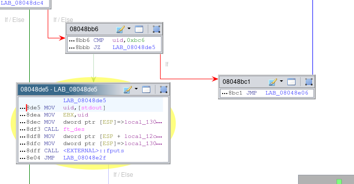

# Level 14

## Analysis

Upon inspecting the home directory and not finding any notable files or services to exploit, our attention turned to analyzing the `getflag` binary to understand how it resolves flag values.

### Initial Steps

We began by locating the binary using the `whereis` command and then transferred it via SSH using the `scp` command for closer examination. For reverse engineering, we utilized [`Ghidra`](https://ghidra-sre.org/), a powerful tool that offers extensive features for dissecting binary files.

In Ghidra, we discovered the condition to retrieve the flag based on the UID:



### Understanding the Binary

From the assembly instructions, we noted the use of `JZ` (Jump if Zero), indicating a conditional jump in the program flow. This hinted that bypassing this condition could lead us directly to the desired address where the flag retrieval logic is executed.

### Bypassing with GDB

To exploit this, we employed `gdb`, to manipulate the program's execution flow:

```bash
level14@SnowCrash:~$ gdb getflag -q
(gdb) b main
Breakpoint 1 at 0x804894a
(gdb) run
Starting program: /bin/getflag

Breakpoint 1, 0x0804894a in main ()
(gdb) ju *0x08048de5
Continuing at 0x8048de5.
```

Through careful manipulation within `gdb`, we were able to force the program to jump to the desired address, effectively bypassing the UID check. The output confirmed that the manipulation was successful, though with a stack smashing detection due to the abrupt jump:

```
7QiHafiNa3HVozsaXkawuYrTstxbpABHD8CPnHJ
*** stack smashing detected ***: /bin/getflag terminated
...
```

Despite the program termination due to stack smashing, the essential output was obtained - the flag needed to log in as `flag14`. With this flag, we could then log in and execute the `getflag` command legitimately to complete the challenge.